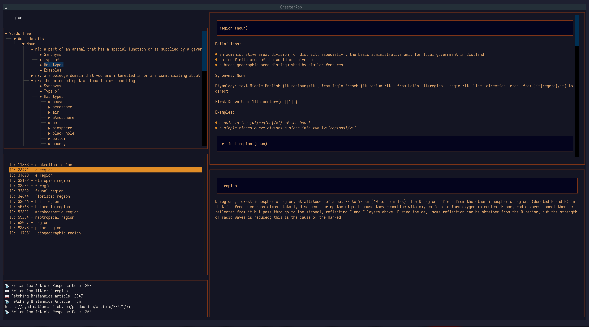
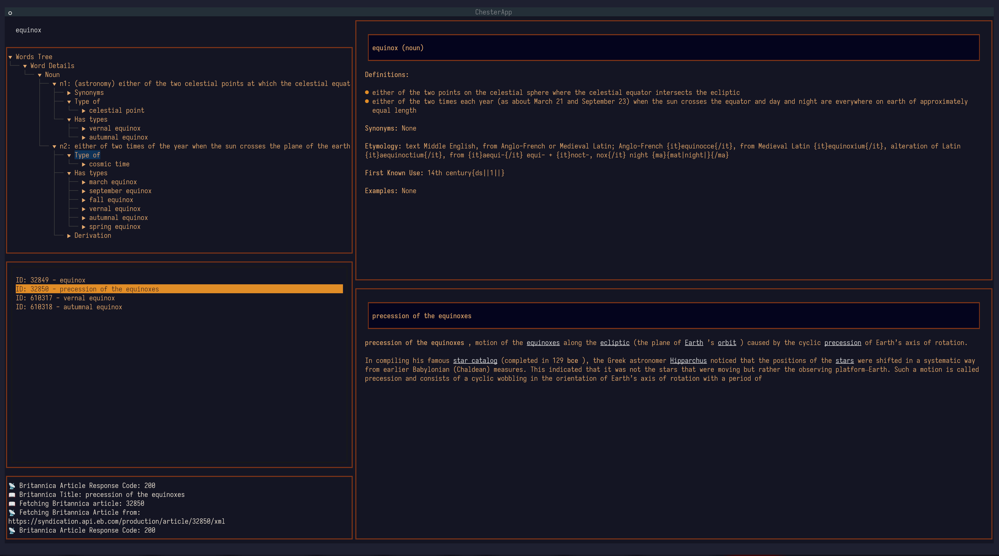
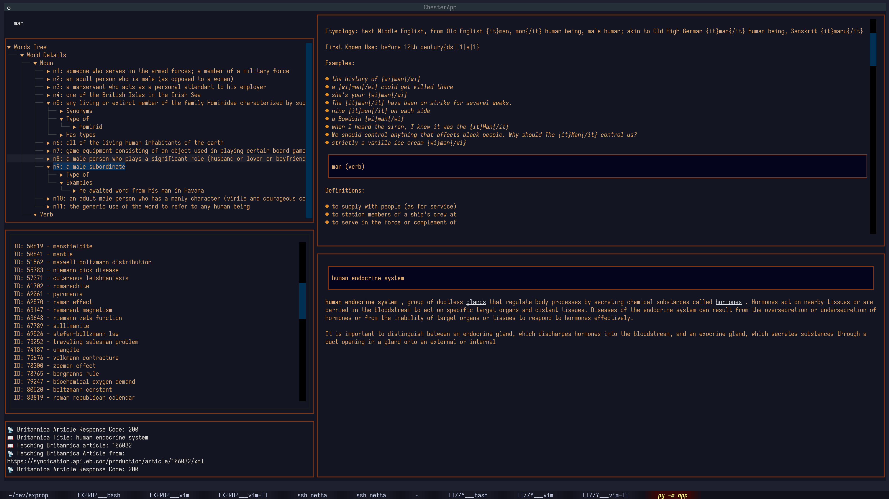

# Lizzy

Lizzy is a dynamic word browser, thesaurus and dictionary explorer that integrates data from various dictionary and encylopaedic sources -- names after St. Elizabeth's Government Hospital for the Insane, where W. C. Minor resided during most of the composition of the OED (in memoriam).

## Features

- **Multi-Source Word Exploration**: Fetches word definitions, synonyms, and related words from:
  - **WordsAPI** (General word lists and relationships)
  - **Merriam-Webster** (Dictionary definitions)
  - **Encyclopedia Britannica** (Detailed encyclopedic information)
- **Interactive Word Navigation**: Explore words dynamically through intelligent linking.
- **Fast Lookup**: Quickly retrieve word data from multiple APIs.
- **Simple UI**: Lightweight and efficiently terminal-based yet sexy thanks to [textual](https://github.com/Textualize/textual).

## Requirements

- Python 3.8+
- API keys for:
  - **WordsAPI** (`WORDS_API_KEY`)
  - **Merriam-Webster** (`MERRIAM_WEBSTER_KEY`)
  - **Encyclopedia Britannica** (`EB_API_KEY`)

### Python Dependencies
Install required Python packages using:
```sh
pip install -r requirements.txt
```

## Installation

1. **Clone the Repository:**
   ```sh
   git clone https://github.com/fsncps/lizzy.git
   cd lizzy
   ```
2. **Set Up Virtual Environment (Optional but Recommended):**
   ```sh
   python -m venv venv
   source venv/bin/activate  # On Windows use: venv\Scripts\activate
   ```
3. **Install Dependencies:**
   ```sh
   pip install -r requirements.txt
   ```
4. **Set Up API Keys:**
   Export your API keys as environment variables:
   ```sh
   export WORDS_API_KEY="your_words_api_key_here"
   export MERRIAM_WEBSTER_KEY="your_mw_key_here"
   export EB_API_KEY="your_eb_key_here"
   ```
5. **Run  as a package:**
   ```sh
   python -m app
   ```

## Roadmap
- [ ] Additional API integrations
- [ ] Create a full-version Encyclopedia Britannica DB from a public domain version with embeddings for cosine similarity matching of terminology rather than text search (from Britannica.com you only get stubs)
- [ ] Utterly utopic at this point, but maybe set up some kind of OED account sharing, if the allow it. OED is by far the best English dictionary, but they want $50/month for the API. I'd be willing to pay $5. 
- [ ] If there is any demand, a web interface, altohugh I much prefer the TUI.
- [ ] Inegration with Clio memory palace (TBA)

## Screenshots







